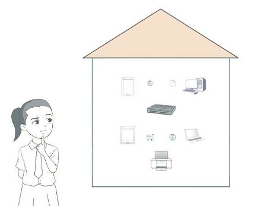
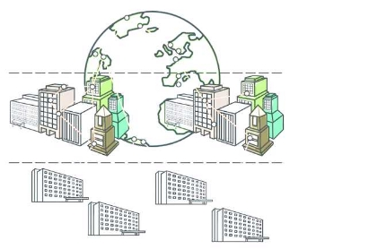
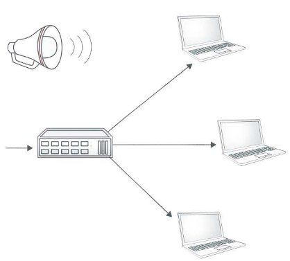
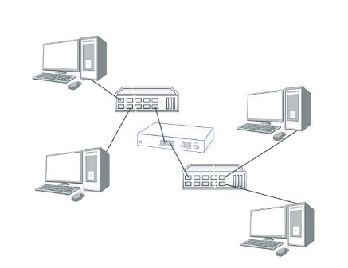
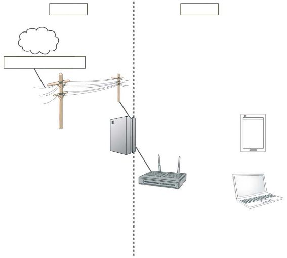
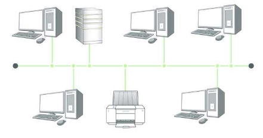
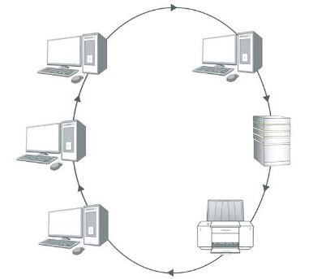
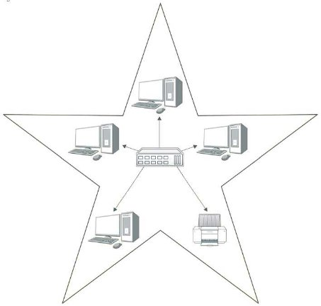

11

||Module 2: Systems and Communications|
| :- | - |
|||
How Do I Create a Simple Network?

Siti’s family has several devices, such as laptops, mobile phones, tablets and a wireless printer. She wants to create a simple network to connect all these devices together in her new home so that data can be transferred between them. Previously, she could only print her assignments from her brother’s desktop computer but not from her laptop. She would like to print from both devices.

In previous chapters, we learnt about ethical issues that relate to the use of computers in public and private networks. The world is becoming increasingly connected with the growing number of network hardware being linked to the Internet. Computer networking has enabled the fast and effective transfer of data, which is essential for the daily operations of businesses and our way of life.

In this chapter, we will learn about what makes up a network and the different types of networks. We will also learn about the practical concerns of implementing a wired and a wireless network, the differences between client-server and peer-to-peer network architectures, and the components of a simple home network.

|By the end of this chapter, you should be able to:|
| - |
|
- Identify and explain the function of different network hardware: modem, network interface controller, hub, switch and router.

- Describe the difference between wired and wireless networks and explain the factors    that will determine the use of each type of network.

- Describe  the  components  for  a  simple  home  network  and  design  a  simple    home network.

- Compare  and  contrast  client-server  and  peer-to-peer  network  strategies  with    emphasis on:

- Purpose

- Function

- Organisation

- Bandwidth

- Explain the use of parity and checksums in data transmission.
|
1. Computer Network

396

A computer network is a system of two or more computers that are connected together by a **transmission medium** for the exchange of data.

Table  11.1  on  the  next  page  shows  some  advantages  and disadvantages of a computer network. 

**Key Term**

**Transmission medium **Means of connecting two or more computers together, such as using copper cables, radio waves or light pulses, so that they may exchange data and interact with each other

- **Table 11.1**  Advantages and disadvantages of a computer network

|**Advantages**|**Disadvantages**|
| - | - |
|
- Shared resources: A network allows a group of computers to make use of shared resources such as printers 

or files.

- Shared Internet access: Depending on the network’s configuration, every user who logs on to the network may have access to the Internet.

- Shared software: Software can be stored on the central server of a network and deployed to other computers over a network.

- Shared storage: Data files can be stored on a central server for ease of access and backup purposes.

- Communication: Computers in the same network are often able to share instant messages and emails for communication.
|
- Initial costs: Installing a network could be costly due to the high setup and equipment costs.

- Maintenance costs: There are also subsequent costs associated with administering and maintaining the network.

- Security risks: As files are shared through a network, there is the risk 

of virus or worm attacks spreading throughout the network even with just one infected computer.

- Risk of data loss: Data may become lost due to hardware failures or errors. Using a network means regular data backups are needed.

- Server outage: If the server fails, the network will not be able to function, thus affecting work processes.
|
2. Types of Computer Networks

Computer networks can be classified according to their geographical size, transmission medium and network organisation type.

1. Geographical Size

Depending on the geographical coverage of the network, a network can be classified into one of the following types:

1. Local area network
1. Metropolitan area network
1. Wide area network

The number of users that it serves will also vary according to its geographical size. 

1. Local Area Network

397

A **local area network (LAN)** is a network of computing devices connected within a small geographical area, typically within the same building, such as a home, school or office. Due to the small number of connections supported and the close proximity of the devices, LANs typically provide faster data transfer than the other networks.

The size of the network in Siti’s home is relatively small. Thus, her home network is a LAN.

2. Metropolitan Area Network

A  **metropolitan  area  network  (MAN)**  is  a  network  of computing devices covering a larger geographical area – two or more buildings within the same town or city – than 

a LAN. A MAN is typically owned and operated by a large organisation such as a business or government body.

3. Wide Area Network

A **wide area network (WAN)** is a network of computing devices covering a large-scale geographical area, typically across multiple geographical locations.

A WAN generally consists of multiple smaller networks such as LANs or MANs.

**Key Terms**

**Local area network (LAN) **Network of computing devices connected within 

a small geographical area, typically within the same building, such as a home, school or office

**Metropolitan area network (MAN)** Network of computing devices typically spanning across two or more buildings within the same town or city

**Wide area network (WAN)**

Network of computing devices covering a large-scale geographical area, typically across multiple geographical locations

398

A WAN differs from a LAN in several ways. Unlike a LAN, a WAN is not limited to a single geographical location and can span long distances via long-range transmission media such as telephone lines, fibre optic cables or satellite links. 

WANs  can  be  either  private  or  public.  Private  WANs  are  built  and  maintained  by  large multinational companies and government organisations. The Internet is an example of a public WAN. A WAN also uses more expensive and high-speed technology than a LAN.

Figure 11.1 compares the geographical distribution of these three types of network.

WAN

Wide Area Network

MAN

Metropolitan Area Network

LAN

Local Area Network

p **Figure 11.1**  Geographical distribution of LAN, MAN and WAN

2. Transmission Medium

399

Networks can also be classified according to their transmission medium,  such  as  cables  or  electromagnetic  waves.  The following sections will describe wired and wireless networks and their transmission media.

1. Wired Networks

A **wired network** is a network of devices connected by a physical medium, such as cables. Data transfer is typically faster and more secure in a wired network. However, as the number of devices and the distance between devices increase, the cost of setting up the network increases as well.

Computers in a network communicate using a set of **network protocols**, just like how people communicate using languages. The **Ethernet** is the most widely used wired network protocol in LANs and MANs. Figure 11.2 shows the connector of an  Ethernet  cable  that  is  used  to  connect  devices  in  a wired network.

**Key Terms**

**Ethernet**

Most commonly used wired network protocol for local and metropolitan area networks 

**Network protocol**

Set of standards and rules that govern how two or more devices communicate over a network 

**Wired network** Network of devices connected by a physical medium, such as cables

p **Figure 11.2**  An Ethernet cable connector

2. Wireless Networks

A **wireless network** is a network of devices in which signals are transmitted without the use of a physical medium. The transmission is in the form of electromagnetic waves, such as radio waves and microwaves. Users can be connected to a wireless network as long as they are within range of the network coverage.

The most common wireless network protocol is Wi-Fi, which uses radio waves to transmit data. 

A **wireless access point (WAP)** is network hardware that provides a connection between wireless devices up to 100 metres away and can connect to wired networks. Obstacles such as walls or metal frames can reduce the strength of Wi-Fi signals. Radio signals such as those from microwave ovens can also interfere with Wi-Fi signals.

Wireless networks are becoming increasingly popular in homes and businesses as they are becoming lower in cost and are easy to configure and manage.

3. Organisation

Computers in a network are generally classified as either clients or servers.

A **client** is a computer that initiates a connection to a server to request for resources and services to perform operations. Employees in offices or students in schools would normally use client computers to do their work.

**Key Terms**

**Client**

Computer that initiates a connection to a server to request for resources and services to perform operations

**Server**

Computer that shares resources with and responds to requests from devices and other servers on the network 

**Wireless access point (WAP)**

Network hardware that provides a connection between wireless devices up to 100 metres away  and can connect to  wired networks

**Wireless network** Network of devices 

in which signals are transmitted without the use of a physical medium

400

A **server** is a computer that shares resources and responds 

to requests from devices and other servers on the network. It usually has a higher capacity and is more powerful than a client as it needs to manage resources and services. These might include:

- Providing central storage of files
- Sharing hardware such as printers
- Controlling logins and network access

Although any computer can function as a server, computers that are designed specifically for use as servers are built to be reliable and less prone to failure. This means that they may be much more expensive than normal computers.

Computers can be organised in either a client-server or peer-to-peer network.

1. Client-Server Network

In a client-server network, one or more higher-capacity computers will act as servers while the remaining computers are clients. Each server contains data and other resources to be shared with clients. The server also fulfils requests from clients.

Table 11.2 shows the advantages and disadvantages of a client-server network.

- **Table 11.2**  Advantages and disadvantages of a client-server network

|**Advantages**|**Disadvantages**|
| - | - |
|
- Centralised control of data  and resources

- Easy to schedule backups of all shared files at regular intervals

- Security may be enhanced with the use of specialised software or  operating system features that are  designed for servers
|
- Higher initial cost due to the need for a server

- Administrative costs needed for the  maintenance of server and clients
|
2. Peer-To-Peer Network

Peer-to-peer (P2P) is a type of network where all computers are considered as equals and the load is distributed among all computers. Each computer in the network is able to act as both a client and a server, communicating directly with other computers. Users are able to share files and resources located on their computers as well as access shared resources found on other computers in the network. These networks are low in cost.

Figure 11.3 shows an example of a P2P network.

Computer Computer

Computer Computer

Computer Computer p **Figure 11.3**  A P2P network

Table 11.3 shows the advantages and disadvantages of a P2P network.

- **Table 11.3**  Advantages and disadvantages of a P2P network

|**Advantages**|**Disadvantages**|
| - | - |
|
- Cheaper to set up as there is no cost related to dedicated servers

- Easy to set up as no specialised  software or operating system features  are needed
|
- More effort is required to access and back up resources as they are stored locally within each computer instead of centrally in a server

- Security is an issue as access rights are  not administered by a central server
|

402

Table 11.4 compares client-server and P2P networks.

**Key Term**

**Bandwidth**

The average number of bits of data that can be transmitted from a source to a destination over the network 

in one second; usually measured 

in megabits per second (Mbps) or gigabits per second (Gbps)

- **Table 11.4**  Comparison between client-server and P2P networks

|**Feature**|**Client-server**|**P2P**|
| - | - | - |
|**Function**|Data and resources are shared using one or more dedicated servers; each computer has a distinct role – client or server|Data and resources are shared directly between computers; each computer acts as both a client and server|
|**Organisation of hardware**|Each client is connected to one or more dedicated servers|Each computer in the network can serve as a client and server at the same time|
|**Bandwidth**|Typically high but limited by the capability of the server|
Varies depending on how 

data needs to be transmitted; **bandwidth** may be reduced if a single computer must handle a large request, but may be increased if a large request can be divided into smaller requests that are handled by multiple computers simultaneously
|
|**Security**|High as access rights can be controlled centrally at a server|Low as security is handled by each computer and not by a central server|
|**Setup cost**|High as the use of specialised high-performance servers would be needed|Low as basic computers can act as servers to share resources|
|**Storage**|Centralised and carried out only at the server; usually managed by a network administrator|Decentralised and can be carried out by individual users at each computer|
|**Application**|Found in businesses or organisations with a large number of users|Found in homes or small businesses where there are  fewer users|
Quick Check 11.2

1. Company X has a remote office in another country that needs to access information from its main headquarters. What is the type of network used in this case?

**A**  LAN

**B**  MAN

**C**  WAN

**D**  None of the above

2. The main office of Y Corporation occupies five floors in their building. What is the type of network used in this case?

**A**  LAN

**B**  MAN

**C**  WAN

**D**  None of the above

3. Write down three advantages of a client-server network.
3. State  whether  each  of  the  features  below  describes  a  client-server  network  or  a peer-to-peer network:
1) Every  computer  is  able  to  directly  share  resources  with  other  computers  in the network.
1) Each computer has a distinct role in the network.
1) It is easier to schedule backups of shared files on this type of network.
3. Factors Affecting Choice of Transmission Medium

Both wired and wireless networks have their advantages and disadvantages. 

Table 11.5 shows the factors that should be considered when deciding between a wired or wireless network.

- **Table 11.5**  Comparison between wired and wireless networks

|**Factor**|**Wired**|**Wireless**|
| - | - | - |
|**Cost**|Initially cheaper but becomes more expensive as network grows in size due to the cost of cables|Initially expensive due to the cost of wireless networking equipment but becomes more cost-effective as network grows in size|
|**Speed of transmission and bandwidth**|Faster and higher bandwidth as cables provide dedicated connection|Generally slower and lower bandwidth due to possible interference from radio waves or microwaves; varies according to user location in relation to network|
|**Reliability** |More reliable as data transmission is unaffected by interference|Less reliable due to potential interference from radio waves and microwaves or blockage from physical obstructions|
|**Security**|More secure as the network is less susceptible to interception and hacking|Less secure due to possible intrusion by hackers |
|**Mobility of users**|Lower as network connections are fixed at specific spots and users cannot move to other locations|Higher as users can move about freely within the range of the wireless network|
|**Scalability**|More cumbersome to add new devices to the network as physical constraints and the running of cables need to be considered|Easier to add new devices to the network as the router can be easily configured|
|**Physical organisation**|Tends to look more disorganised due to cables running across floors|More organised without cables|
Quick Check 11.3

1. Siti wants to send print jobs from both her laptop as well as tablet whenever she is at home. Describe two advantages of using a wireless network to enable printing from multiple devices in her home.
1. Give two reasons why wireless networks are preferred over wired networks at cafes and canteens.
4. Identifiers 

Networks typically have many computers and programs using them at any one time. In order to identify the different networks, computers and programs, we need to give them names and describe their respective functions.

In Chapter 8, you learnt how IP addresses (sections 8.4.2.1 and 8.4.2.2) and MAC addresses (section 8.4.2.3) are used to identify individual computers so that data transmitted over a network can be directed to the correct destination. The following sections will discuss other ways that networks, computers and programs can be identified – using port numbers and SSIDs.

1. Port Numbers

405

A **port number** is used in combination with an IP address to identify a program that is running on a network. Each program that is active on the network must be identifiable by one or more unique combinations of an IP address and a port number. Both clients and servers can run programs that use port numbers to identify themselves. 

A computing device can run multiple programs at the same time. For example, a single computer can run both a web server program with port number 80 and a mail server program with port number 143. All port numbers are assigned in a range from 0 to 65,535.

**Key Term**

**Port number**

Number that is used together with an IP address to uniquely identify a program that is running on a network

**Did you know?**

You can list all the port numbers that are in use on your computer by entering “netstat -na” at the command prompt.

2. Service Set Identifiers 

A **service set identifier (SSID)** is a string of up to 32 bytes that identifies a wireless access point (WAP) and all the devices connected to it. All wireless devices connected to the same WAP must use the same SSID.

If Siti decides to set up a wireless network at home using a WAP, she will need to configure an SSID for her WAP so that her devices can select this WAP and connect to it.

Figure 11.4 shows an example of the SSID of a wireless network.

**Key Term**

**Service set identifier (SSID)** 

A 32-byte string that identifies a wireless access point (WAP) and all devices connected to it

406

p **Figure 11.4**  An example of the SSID of a wireless network

Quick Check 11.4

1. On a computer or laptop connected to the network, use the command line interface or network tools available to find its MAC and IPv4 addresses.
1. Choose the correct words in the statements below from the given choices:
1) A program running on a network can be uniquely identified by its (*MAC address /  port number / SSID*) and IP address.
1) All (*wired/wireless*) devices connected to the same WAP must use the same SSID.
5. Network Hardware and Their Functions

Data is seldom sent in a single stream over networks. Instead, it is broken up into smaller **packets** before being sent independently over the network through devices such as hubs, switches and routers. Besides containing a piece of the original data, each packet also contains a header with information about the source and destination addresses that are needed for transmission. These data packets are then reassembled at the destination device.

1. Network Interface Controller

A network interface controller (NIC) provides the hardware interface to enable the transfer of data between a device and a network. An NIC may connect to a network physically or wirelessly. Most devices are equipped with a built-in NIC. Figure 11.5 shows an example of a wireless NIC.

p **Figure 11.5**  A wireless NIC

As discussed in section 8.4.2.3, each NIC also has a unique 48-bit MAC address that can be used to identify the particular computer or device with that NIC. 

2. Network Hub

407

A **network** **hub** is the simplest way to connect multiple devices to the same network. When a hub receives a packet, the packet is transmitted to all the devices that are connected to the hub. Likewise, when a device responds, the response is sent to every device that is connected to the hub.

In this way, a hub acts like a loudspeaker as it broadcasts the data to all its connected devices without limiting the data to only the specific device it was intended for. 

**Key Terms**

**Network hub (or hub) **Device that transmits received packets to all connected devices

**Packet (computing)**

A unit of broken-up data containing a header with information about the source and destination addresses that are needed for transmission

Figure 11.6 shows how a network hub works.

Computer A

A hub broadcasts data like a loudspeaker

Data for Computer A

Computer B

Data for Data for Hub Computer A

Computer A

Data for

Computer A Computer C

p **Figure 11.6**  How a network hub works

A hub is the cheapest option among all the network connection devices as it does not store any information about the devices that are connected to it. However, because the hub transmits data to all connected devices regardless of the intended recipient, it can cause bottlenecks that reduce the overall efficiency of the network.

3. Network Switch

408

A **network switch** constructs a single network by connecting multiple similar networks together. Switches are typically used to connect multiple LANs that use the same protocol so that the combined network can cover a larger physical area.

Unlike  a  hub  that  simply  repeats  data  to  all  connected devices, a switch uses MAC addresses to keep track of the devices that are connected to it. This lets the switch intelligently decide whether it should drop or forward the packets that it receives.

**Key Term**

**Network switch (or switch) **Device that constructs 

a single network by connecting multiple similar networks together

In Figure 11.7, suppose the switch receives a packet from computer A. The switch first examines the destination MAC address stored in the packet’s header and decides whether to forward or drop the packet. 

**Network 1**

**Network 2**

Hub

Computer A Computer B

Switch Computer C Computer D

Hub

p **Figure 11.7**  How a switch connects two networks

If the destination MAC address is that of computer B, the switch will drop the packet as computers A and B are already on the same network. 

On the other hand, if the destination MAC address is that of computer C or D, the switch will forward the packet to the other network and on towards its intended destination.

**Did you know?**

A network switch that connects exactly two networks together is also called a network bridge. Most large networks use switches and bridges instead of hubs as these devices are more “intelligent” and will send packets through a connection only if the switch or bridge determines that the intended recipient is on the other end, hence avoiding unnecessary bottlenecks. This makes using switches and bridges more efficient than using hubs.

4. Router

409

A **router** forwards packets between separate networks. While a switch combines multiple similar networks that use the same protocol into a single network, a router keeps the connected networks (which may use fundamentally different protocols) separate and forwards packets between them using Internet protocols.

**Key Term**

**Router**

Device that forwards packets between separate networks

For instance, Siti’s Internet service provider (ISP) has supplied 

her with a modem (described in section 11.5.5) that connects to the ISP’s network using a special protocol that works over telephone lines. For Siti to send packets through the ISP’s network using the Ethernet connection on her computer, she will need a router to forward packets between her computer, which uses Ethernet, and the ISP’s network, which uses a different protocol. 

In order for a router to forward packets between different networks using Internet protocols, both the device *sending* the packet and the device *receiving* the packet must be identified using IP addresses. 

Note that switches (described in section 11.5.3) forward packets based on permanent MAC addresses, while routers forward packets based on IP addresses that may change dynamically.

**Did you know?**

The name “Internet” actually comes from the term “internetworking”, which refers to the practice of forwarding packets between different and separate networks. The Internet Protocol achieves this by serving as an additional “overlay” protocol on top of the different Ethernet, Wi-Fi and other protocols used by the separate networks.

5. Modem

While Ethernet cables are useful for LANs and some MANs, they are not suitable for connecting devices over a long distance (such as from Siti’s ISP to her home) as the number of transmission errors increases with cable length. Instead, ISPs typically use special protocols and long-range transmission media such as telephone lines or fibre optic cables.

Long-range transmission media, however, are typically not designed for transferring digital data (i.e., 0 and 1 bits) that are used by computers. For instance, telephone lines are designed for transmitting analogue sounds and not digital data. Hence, it becomes necessary to convert digital data into a form suitable for the transmission medium before it can be transmitted. 

410

The process of converting digital data into a form suitable for transmission is known as **modulation**. The reverse process is known as **demodulation**. On either end of the transmission, the device responsible for modulation and demodulation is known as a **modem** (short for “modulator-demodulator”).

When setting up Internet access in a home network, an ISP will typically provide a modem that sets up a long-distance connection to the ISP’s network. 

In Figure 11.8, a wireless router and a modem are installed to provide Internet access to multiple devices in the home.

**Key Terms**

**Demodulation **Conversion of transmitted signals into digital data

**Modem**

Device responsible  for modulation  and demodulation 

**Modulation** Conversion of digital data into a form suitable for transmission 

411

**WAN LAN**

Internet

Internet service provider

Telephone lines

Modem 192.168.1.9 86.102.26.202

Router

Public IP address assigned 192.168.1.1 by Internet service provider (ISP)

Private IP addresses assigned by router

p **Figure 11.8**  How a LAN is connected to the public network using a modem

Quick Check 11.5

1. Which of the following network hardware allows separate networks that use different network protocols to be connected together?

**A**  Firewall **B**  Hub

**C**  Switch **D**  Router

2. Give two examples of network hardware used in your home and school.
6. Network Topologies

A topology describes the physical layout of a network. Understanding the topology is essential to designing a network.

1. Bus Topology

In the bus topology, a common cable or backbone known as the bus connects all the devices. The bus is a medium that allows the transmission of data. It also allows the devices to communicate with the server, with each other and with devices such as a shared printer.

During communication, a sender will transmit data along the bus and all the devices connected to the bus can detect that data is being transmitted. However, only the intended recipient will accept and process the data.

Figure 11.9 shows how the devices are connected in a bus topology.

Computer Server Computer Computer

Data bus

Computer Printer Computer p **Figure 11.9**  A bus topology network

Table 11.6 shows the advantages and disadvantages of a bus topology.

- **Table 11.6**  Advantages and disadvantages of a bus topology

|**Advantages**||**Disadvantages**|
| - | :- | - |
|- Easy and cheap to install as it uses less ||- A break anywhere along the bus may |
|cabling than other network designs||disable the entire network|
|- Scalable as new computers can be ||- The size of the network is limited by  |
|easily added||the capacity and length of the bus|
|- Can continue to operate even when ||- A single bus is unsuitable for networks  |
|one of the computers breaks down||with many computers; performance |
|- Works well for small networks||slows down as the number of  computers increases|
2. Ring Topology

In the ring topology, each computer is connected to two other computers in a ring formation. All the data is passed around in the same direction. If a failure occurs in the cable or if a computer breaks down, the entire network will fail to function. 

Figure 11.10 shows how the devices are connected in a ring network.

Computer Computer

Computer Server

Computer Printer p **Figure 11.10**  A ring topology network

Table 11.7 shows the advantages and disadvantages of a ring topology.

- **Table 11.7**  Advantages and disadvantages of a ring topology

|**Advantages**||**Disadvantages**|
| - | :- | - |
|- Can operate over larger distances and ||- If a computer or cable in the network |
|handle more data than a bus topology||fails, the entire network may fail as the  |
|- Data packets that are sent between ||data cannot be passed on|
|two computers will pass through  ||- Adding a new computer to the |
|intermediate computers, hence a ||ring network would mean that the |
|central server is not required to  ||whole communication ring needs to |
|manage the network||be temporarily interrupted|
3. Star Topology

In the star topology, network hardware such as a hub or switch is at the centre of the network with connections to all the other computers. The computers will send data to the central network hardware and the hardware forwards the data to the intended destination. 

Figure 11.11 shows how the devices are connected in a star topology.

Computer

Computer Computer

Network hardware in the centre such as 

a hub

Computer Printer

p **Figure 11.11**  A star topology network

Table 11.8 shows the advantages and disadvantages of a star topology.

- **Table 11.8**  Advantages and disadvantages of a star topology

|**Advantages**||**Disadvantages**|
| - | :- | - |
|- The load on each section of cabling is ||- Uses more cabling than other  |
|reduced as each computer uses a ||topologies and hence costs more|
|separate cable from the rest||- If the central network hardware fails, |
|- If a fault occurs at a computer or  ||the entire network fails|
|cable, it is easy to isolate the fault and |||
|do a replacement without affecting the |||
|rest of the network|||
Quick Check 11.6

1. The                       describes how the network is arranged and how resources are shared.

**A**  communication channel **B**  network topology

**C**  network hub

**D**  local area network

2. Which of the following network topologies is the least reliable in the event of a breakdown of a computer in the network?

**A**  Bus

**B**  Client-server **C**  Ring

**D**  Star

3. Jake plans to set up an accountancy consulting business in town. He wants to have a LAN in his office. He has about 100 staff working in the same office while about 20 other staff work from offsite locations such as his clients’ offices. The staff need to share files among themselves and be able to connect to printers. Most of the data being handled is confidential and dates back from 10 years ago to the present. He also has plans to expand his business in the next five years.
1) Which network topology is most suitable in this case? Why?
1) Explain why a client-server network is preferred over a peer-to-peer network by considering bandwidth, security and storage issues.
7. Error-Checking Methods in Data Transmission

Data can become lost or corrupted during transmission. As mentioned in section 11.5, data is seldom sent in a single stream, but is instead broken up and sent in smaller packets. This allows us to focus on detecting transmission errors one packet at a time.

There are two basic error-checking methods to ensure that the data received at the destination is the same as that at the source: 

1. Parity check 
1. Checksum

Each packet illustrated in the following examples is eight bits long. Note that, in reality, the packets are usually much longer.

1. Parity Check

416

In **parity check**, an additional bit is either appended or prepended to a string of binary data for transmission. This **parity bit** can be either 0 or 1, depending on whether an odd or even parity system is used. Parity bits are the simplest method of error detection. 

In the odd parity system, the total number of 1 bits in each packet (including the parity bit) should be odd. In the even parity system, the total number of 1 bits in each packet (including the parity bit) should be even.

For example, the packet in Figure 11.12 has the original data bits 1010001. There are three 1 bits in the original data string. In an even parity system, the parity bit of 1 would be added to increase the total number of 1 bits in the packet to four, 

which is an even number.

**Key Terms**

**Parity bit**

Additional bit, which can be either 0 or 1 depending on whether an odd or even parity system is used, that is appended or prepended to a string of binary data before transmission 

**Parity check** Error-checking technique which uses a parity bit to detect errors

parity bit original data bits

|**1**|1|0|1|0|0|0|1|
| - | - | - | - | - | - | - | - |
p **Figure 11.12**  Each packet in an even parity system should have an even number of 1 bits

Table 11.9 describes the two possible scenarios that may occur when the packet arrives at the destination. If the data transmission is successful, the total number of 1 bits detected would be even, which is the same as that at the source. This means that the data is error-free. However, if there is a simple error in the data transmission, the total number of 1 bits detected would be odd, which differs from that at the source. This means that the data is corrupted.

- **Table 11.9**  Successful and failed data transmission in an even parity system

|**Original  data bits**|
**Parity system**  

- **even**
|**Data transmission** |
| :- | - | - |
|||**Successful**|**Unsuccessful**|
|1010001|**1**1010001|
11010001

**Total number of  1 bits is even** 
|
11110001

**Total number of  1 bits is odd** 
|
If the same packet is used in an odd parity system instead, then the parity bit of 0 is added, as there is already an odd number of 1 bits in the original data string. 

parity bit original data bits

|**0**|1|0|1|0|0|0|1|
| - | - | - | - | - | - | - | - |
p **Figure 11.13**  Each packet in an odd parity system should have an odd number of 1 bits

Table 11.10 describes the two possible scenarios that may occur when the packet arrives at the destination. If the data transmission is successful, the total number of 1 bits detected would be odd, which is the same as that at the source. This means that the data is error-free. However, if there is a simple error in the data transmission, the total number of 1 bits detected would be even, which differs from that at the source. This means that the data is corrupted.

- **Table 11.10**  Successful and failed data transmission in an odd parity system

|**Original  data bits**|
**Parity system**  

- **odd**
|**Data transmission** |
| :- | - | - |
|||**Successful**|**Unsuccessful**|
|1010001|**0**1010001|
01010001

**Total number of  1 bits is odd** 
|
11010001

**Total number of  1 bits is even** 
|
Parity checking has certain limitations. For instance, it is able to detect that an error has occurred but cannot determine where the error occurred. 

It is also unable to detect all the possible types of errors. It can detect simple errors where only a single bit is changed, but not serious errors where multiple bits are changed. In particular, if two different errors occur in a single packet, they can effectively cancel each other out and result in the correct parity even though the data is actually corrupted. 

In general, parity checking can only detect errors when an odd number of bits have been corrupted but not when an even number of bits have been corrupted.

2. Checksum

A **checksum** is a calculated value that is used to determine the integrity of transmitted data. A checksum serves as a unique identifier for the data and is sent together with the data.

Before transmission, the checksum for the data is first calculated. Assuming that the checksum is one byte in length, it can be calculated in two ways.

If the sum of all the bytes in the data is less than or equal to 255, the checksum is this value. If the sum is greater than 255, the checksum is the modulus of 256. 

418

For example, if the sum is 1,350, the checksum is 1,350 modulo 256, which gives 70.

The data and the checksum are then sent together. At the destination, the checksum is recalculated and compared to the sent checksum value. If the checksum value of the received data matches the sent checksum value, the data was transmitted correctly. If they differ, an error has occurred.

**Key Term**

**Checksum**

Calculated value that is used to determine the integrity of transmitted data

Quick Check 11.7

1. Determine the parity bit for the data string in Figure 11.14 if an odd parity system is used.

||1|1|0|0|0|0|1|
| :- | - | - | - | - | - | - | - |
p **Figure 11.14**  A 7-bit data string in an odd parity system

2. Determine the parity bit of the following data strings if an even parity system is used:
1) 1001000
1) 1100110
1) 1001111
3. Determine whether each of the following data packets has been corrupted. Use the parity check method, given that the last bit is the parity bit and an odd parity system is used.
1) 11100111
1) 11011010

Chapter Summary

**Local Area  Wide Area Network Network**

**Wired Client-Server  Network Network Metropolitan** 

**Area Network**

**Wireless Peer-to-Peer  Network**

**Network**

**GEOGRAPHICAL  TRANSMISSION ORGANISATION SIZE MEDIUM**

**Parity Check Port Numbers**

**TYPES**

**Service Set Checksum**

**Identifiers**

**COMPUTER** 

**ERROR-CHECKING  NETWORKS IDENTIFIERS**

**METHODS**

**HARDWARE NETWORK TOPOLOGY**

**Network** 

**Interface  Bus Controller**

**Network Hub Ring**

**Network  Star**

**Switch**

**Router**

**Modem**

Review Questions

1. State three advantages of setting up a home or office network.
1. Match statements A–L below to the correct network architecture in Table 11.11.
1. Access to shared resources on the network such as printers, data files and web access is managed by servers
1. Resources and files located on one computer are accessible by all other computers within the network
1. All computers are independent of each other and are of equal status when communicating with each other
1. The network consists of computers operated by users and centralised computers which control the resources of all computers
1. Regular backups can be easily implemented with the use of a centralised backup storage
1. Backups are difficult to organise since there is no centralised backup storage
1. Data is stored independently in each computer
1. Data is stored in a centralised storage device monitored by the server
1. More commonly found in businesses and organisations
1. More commonly found in homes
1. There is often no mechanism to manage access to the network, hence it is less secure
1. Access to the network is managed using a database of usernames, passwords and user profile and permission settings, hence the network tends to be more secure
- **Table 11.11**  Network architecture

|**Design factors**|**Peer-to-peer**|**Client-server**|
| - | - | - |
|a) Organisation of components|||
|b) Resource management|||
|c) Storage|||
|d) Mode of backup|||
|e) Security|||
|f) Type of environment|||
3. A doctor wishes to set up a LAN in his new clinic. He has three staff located at different counters within the clinic. During operating hours, he and his staff need to retrieve records from a patient history database using their individual desktop computers. They will also need to access a shared network printer to print receipts and medical certificates. 

For security reasons, the patient history database and printer must be isolated from the Internet and connected using a wired network. However, he would still like to provide his patients with free wireless Internet access while they wait for their consultation.

1) The doctor purchases a network switch to help set up the LAN. Name the network topology that is formed when multiple devices are connected to the network switch.
1) The patient history database needs to be accessed and modified by the doctor and his staff multiple times throughout the day. Recommend, with explanation, whether the patient history database should be stored on a single server or distributed among the doctors and his staff using a peer-to-peer network.
1) Draw a labelled diagram of the clinic’s network(s). The diagram should include at least four laptops, one printer, one fibre optic modem (for Internet access), one network switch and one combined wireless router/access point. You may include additional devices as needed.
422
